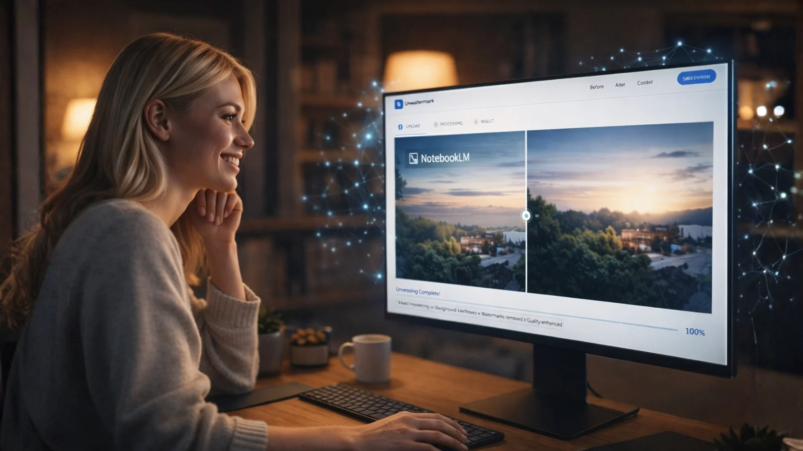
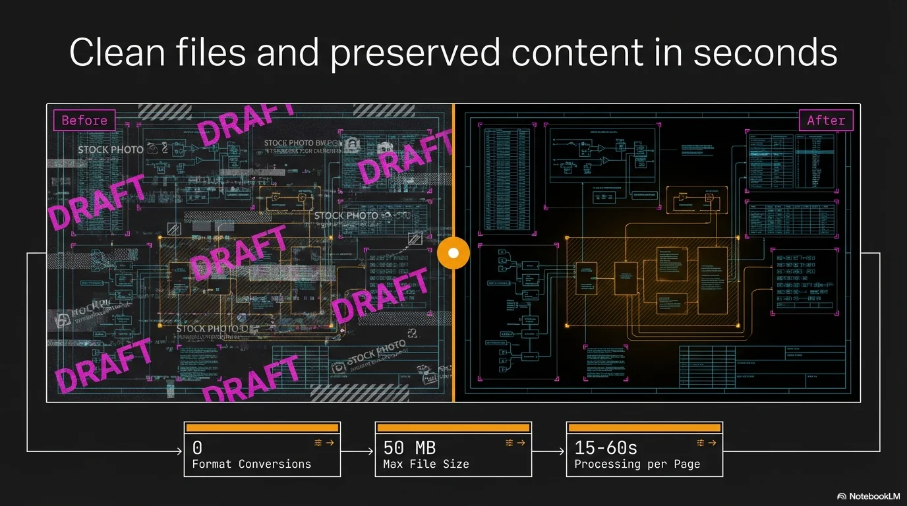
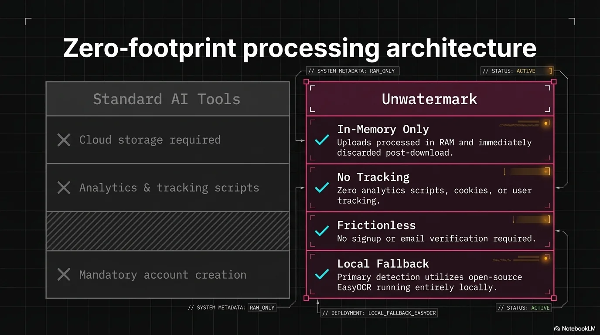
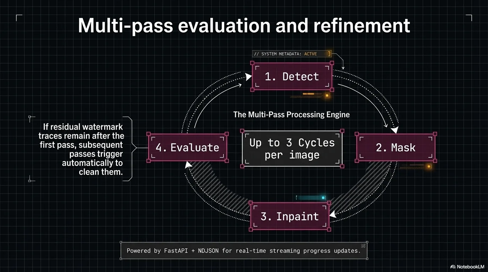
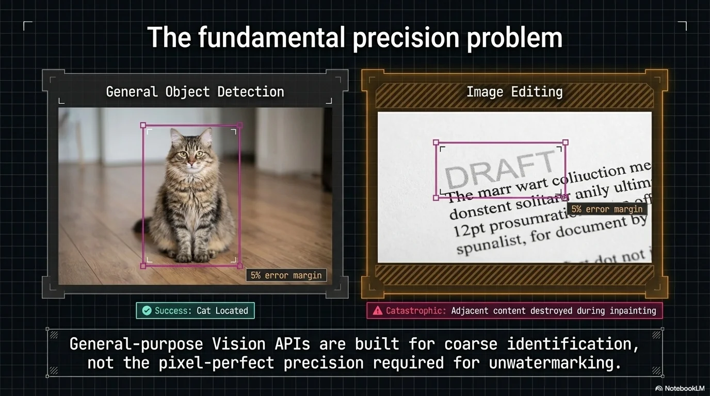
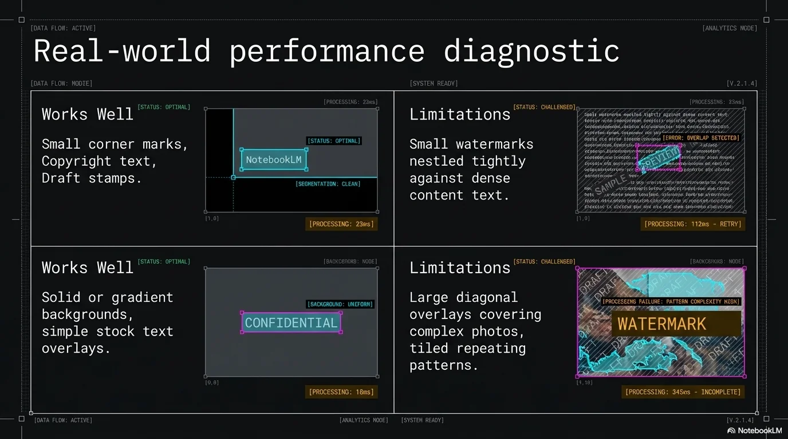
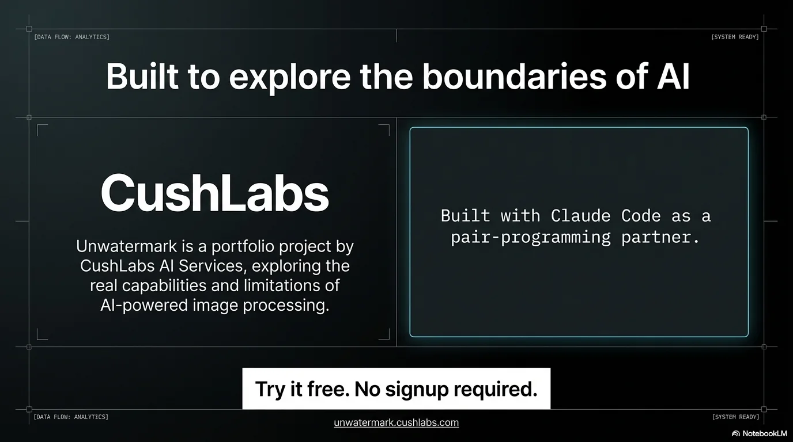

# Unwatermark


> AI-powered watermark removal for images, PDFs, and PPTX files. Layered detection pipeline with neural inpainting — drop a file, get a clean version.

<p align="center">
  
</p>

## Overview

Unwatermark detects and removes baked-in watermarks from images, PDF documents, and PowerPoint presentations. It was built to solve a specific problem: tools like NotebookLM export slide decks where every slide is a single PNG with the watermark composited directly into the image — there's no layer to delete.

Rather than simple cloning or blurring, Unwatermark uses a **layered AI detection pipeline** paired with **LaMa neural inpainting** to reconstruct the area beneath the watermark while preserving surrounding content.

**Live at [unwatermark.cushlabs.ai](https://unwatermark.cushlabs.ai)**

## Detection Pipeline

```
Image → EasyOCR (text watermarks — free, deterministic, local)
         ↓ found? → refine with SAM → inpaint
         ↓ nothing?
      Florence-2 via Replicate (text + visual detection)
         ↓ found? → refine with SAM → inpaint
         ↓ nothing?
      Grounded SAM (detection + pixel mask in one call)
         ↓ found? → inpaint
         ↓ nothing?
      Claude Vision (legacy fallback for non-standard watermarks)
         ↓ found? → refine with SAM → inpaint
         ↓ nothing?
      Heuristic fallback (position-based guess)
```

Each detection result is refined through **SAM pixel-perfect masking** to produce a binary mask (white = watermark, black = keep). This feeds directly into LaMa inpainting so only actual watermark pixels are removed — no collateral damage.

Images go through **up to 3 detect-remove cycles** to catch residual watermarks exposed after the first pass.

## Screenshots

<p align="center">
  
  
</p>
<p align="center">
  
  
</p>
<p align="center">
  
  
</p>

## Tech Stack

| Component | Technology |
|-----------|-----------|
| Language | Python 3.10+ |
| Text Detection | EasyOCR |
| Visual Detection | Florence-2, Grounded SAM (Replicate) |
| AI Fallback | Claude Vision (Anthropic SDK) |
| Inpainting | LaMa (Replicate) |
| Web Framework | FastAPI + Uvicorn |
| Image Processing | Pillow, NumPy |
| PDF Processing | PyMuPDF (fitz) |
| PPTX Processing | python-pptx |
| CLI | Click |
| Deployment | Docker, Caddy, Hetzner VPS |

## Getting Started

### Prerequisites

- Python >= 3.10
- API keys: `ANTHROPIC_API_KEY` (required), `REPLICATE_API_TOKEN` (required for production detection/inpainting)

### Installation

```powershell
# Clone the repository
git clone https://github.com/RCushmaniii/cushlabs-ai-unwatermark.git
cd cushlabs-ai-unwatermark

# Create virtual environment
python -m venv .venv
.venv\Scripts\Activate.ps1

# Install with all extras
pip install -e ".[all]"

# Copy environment config
cp .env.example .env
# Edit .env with your API keys
```

### Usage — Web UI

```powershell
uvicorn unwatermark.web:app --reload
```

Open `http://localhost:8000` — drag and drop a file, get a clean version with real-time progress.

### Usage — CLI

```powershell
# Remove watermark from an image
unwatermark input.png

# Process a PPTX with annotation hint
unwatermark presentation.pptx --annotate "NotebookLM watermark bottom-right"

# Skip AI detection (OCR + heuristic only)
unwatermark document.pdf --no-ai
```

## Project Structure

```
src/unwatermark/
├── cli.py                  # Click CLI entry point
├── web.py                  # FastAPI web UI (NDJSON streaming progress)
├── config.py               # API keys, provider/backend selection
├── core/
│   ├── ocr_detector.py     # EasyOCR-based detection (primary)
│   ├── detector.py         # Layered routing: OCR → AI → heuristic
│   ├── analyzer.py         # Claude Vision / GPT-4o integration
│   ├── multipass.py        # Multi-pass detect-remove loop
│   ├── remover.py          # Strategy router → technique dispatch
│   ├── strategies.py       # Strategy selection (prefers LaMa)
│   └── techniques/
│       ├── lama_inpaint.py # LaMa neural inpainting
│       ├── clone_stamp.py  # Clone-stamp fallback
│       └── solid_fill.py   # Solid/gradient fill fallback
├── handlers/
│   ├── image.py            # Standalone image processing
│   ├── pdf.py              # PDF render → clean → reassemble
│   └── pptx.py             # PPTX image blob replacement
├── models/
│   ├── analysis.py         # WatermarkAnalysis, WatermarkRegion
│   └── annotation.py       # UserAnnotation dataclass
└── pages/
    └── app.py              # Inline HTML/JS for the web UI
```

## Scope

Optimized for **corner watermarks** — NotebookLM, copyright text, small logos. Works well for watermarks covering <25% of the image. Not designed for stock photo tiled patterns or large diagonal overlays across the full image.

## Contact

**Robert Cushman** — CushLabs AI Services
Guadalajara, Mexico

[info@cushlabs.ai](mailto:info@cushlabs.ai) | [GitHub](https://github.com/RCushmaniii) | [LinkedIn](https://linkedin.com/in/robertcushman) | [cushlabs.ai](https://cushlabs.ai)

## License

© 2026 Robert Cushman. All rights reserved.
